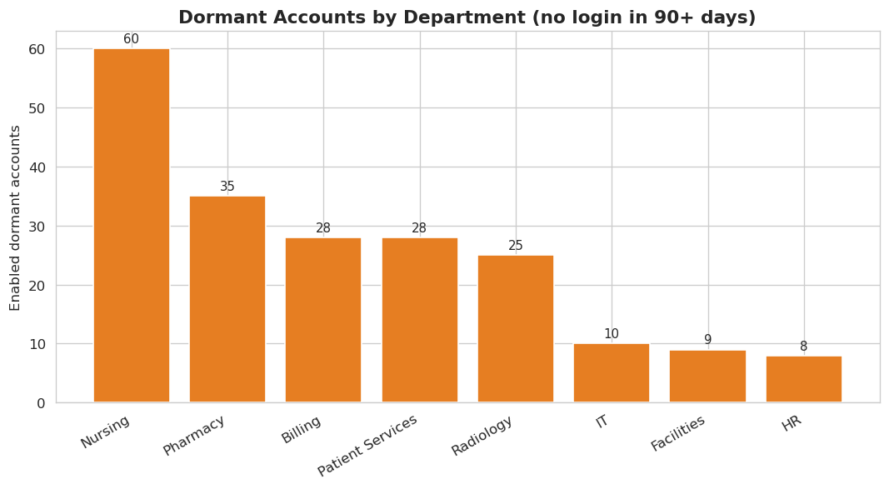
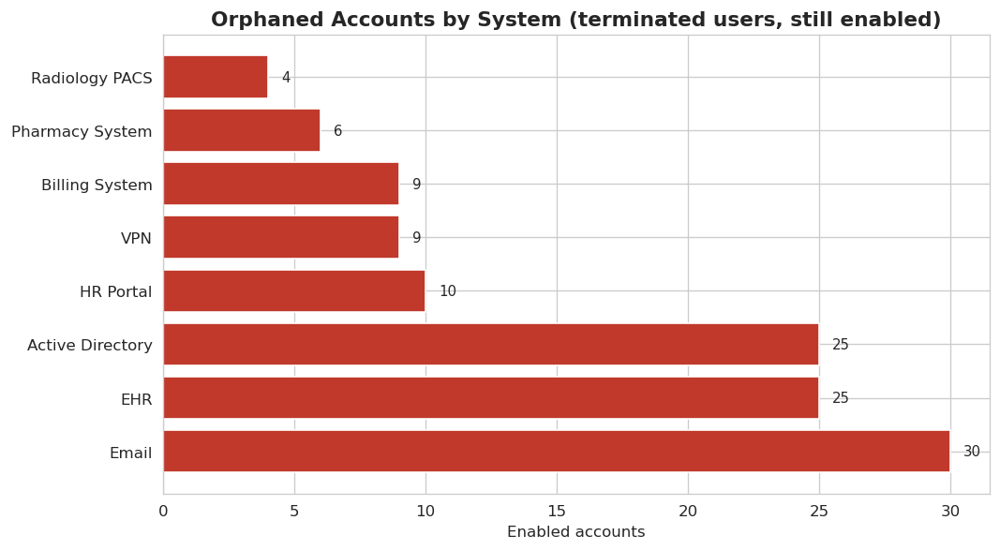
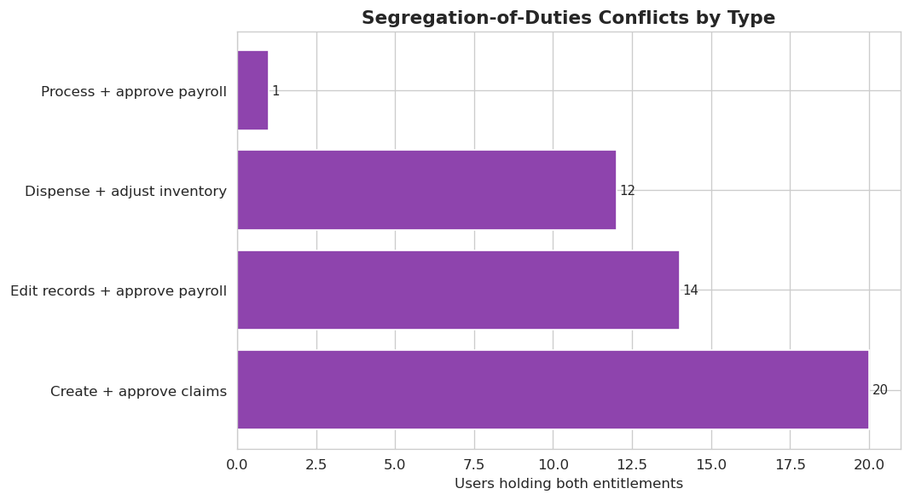
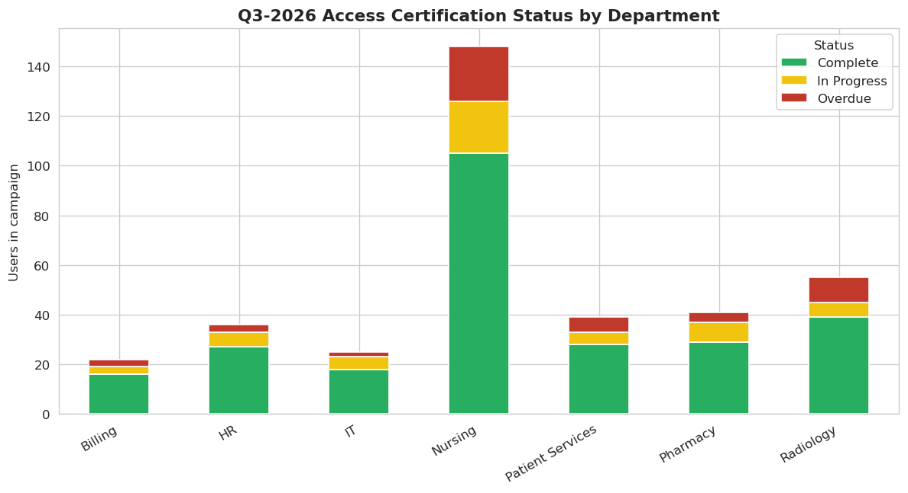
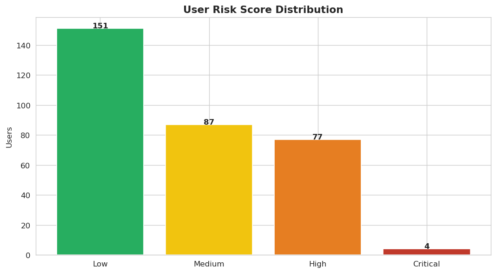
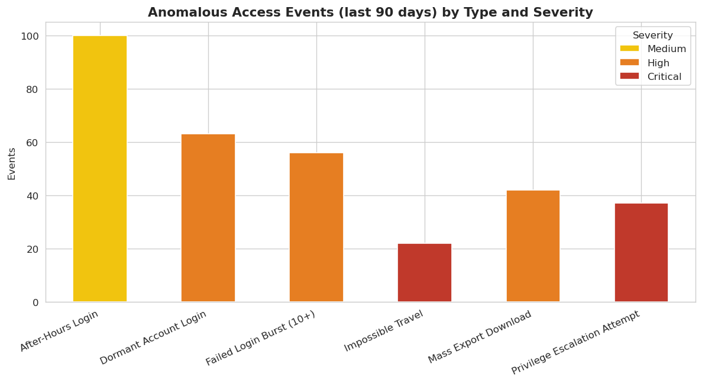

# Identity & Access Governance Analytics

An analytics project that hunts for identity-risk in a healthcare organization:
orphaned and dormant accounts, privilege creep, segregation-of-duties conflicts,
and access-certification gaps — the same findings an IAM analyst or ISSO
surfaces during access reviews and audits.

> **Note on data:** every dataset here is **synthetic**, generated by
> `generate_data.py` (seeded, so fully reproducible). It mirrors the *patterns*
> I've worked with in HIPAA-regulated environments — least-privilege reviews,
> access alignment, and audit-ready documentation — without using or implying
> any real personal data.

## The scenario

**Lone Star Health**, a fictional regional healthcare organization:
600 users across 8 departments (Nursing, Billing, Pharmacy, Radiology, IT,
HR, Patient Services, Facilities), 2,351 accounts, and 1,988 entitlements
spanning 8 systems (EHR, Billing, Pharmacy, Active Directory, VPN, HR Portal,
Radiology PACS, Email).

## What the analysis does

| # | Analysis | Why it matters |
|---|----------|----------------|
| 1 | **Orphaned accounts** — enabled accounts belonging to terminated users | #1 finding in most access audits; direct HIPAA/least-privilege violation |
| 2 | **Dormant accounts** — enabled, no login in 90+ days (privileged flagged) | Prime targets for credential compromise |
| 3 | **Privilege creep** — manual/exception grants outside role baselines | Shows where RBAC is eroding |
| 4 | **SoD conflicts** — toxic pairs (e.g., create *and* approve claims) | Fraud risk; auditors ask about these first |
| 5 | **Certification gaps** — Q3-2026 access-review completion by department | Measures whether reviews actually happen |
| 6 | **Risk scoring** — composite per-user score → Critical/High/Medium/Low | Turns six findings into one prioritized work queue |

## Key findings

- **118 orphaned accounts** belonging to 42 terminated users (5.3% of enabled
  accounts) — the longest still enabled **951 days** past termination.
- **203 dormant accounts** idle 90+ days, including **6 privileged accounts**.
  Nursing carries the most (60).
- **66 manual/exception grants** sit outside role baselines; **58 are
  High/Critical risk** across 57 users — clear privilege creep.
- **47 segregation-of-duties conflicts** across 46 users, most commonly
  *create + approve claims* in Billing (20 users).
- **Certification is 72% complete** — 122 high-risk entitlements remain
  unreviewed and 50 users are overdue.
- **Risk scoring** puts 4 users in Critical and 77 in High, giving reviewers a
  prioritized queue instead of a raw dump.

## Visualizations








## How to run it

```bash
pip install -r requirements.txt
python3 generate_data.py   # builds the synthetic dataset in ./data
python3 analysis.py        # runs all six analyses -> ./visualizations
```

## Project structure

```
├── generate_data.py     # synthetic data generator (seeded, reproducible)
├── analysis.py          # the six access-governance analyses + charts
├── requirements.txt
├── data/                # generated CSVs (users, accounts, entitlements,
│                        #   role_baselines, access_events, certifications)
└── visualizations/      # output charts
```

## What I'd do with real data

- Join HR termination feeds to identity stores so orphaned-account detection
  runs **continuously**, not quarterly.
- Feed the risk scores into the ticketing queue (ServiceNow) so the riskiest
  users get reviewed first.
- Map each finding to NIST SP 800-53 controls (AC-2, AC-5, AC-6) and track
  remediation as POA&M items.

## Tech

Python · pandas · NumPy · matplotlib · seaborn
